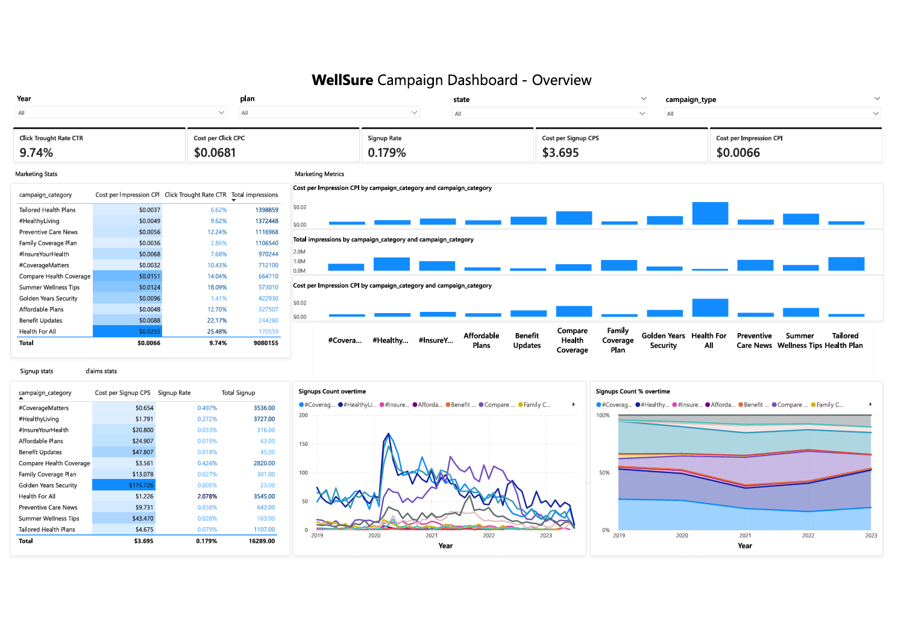

#  WellSure - Analyse des Campagnes Marketing

**Un projet d’analyse de données pour évaluer l'efficacité des campagnes et orienter les décisions budgétaires**

---

##  À propos du projet

Ce projet présente une analyse complète des performances marketing de **WellSure**, une compagnie d’assurance santé basée aux États-Unis, au service de milliers de clients à travers le pays. En 2019, WellSure a lancé une nouvelle série de campagnes marketing axées sur la prévention, l’accessibilité des plans et l’éducation à la santé.

Dans le cadre de la préparation de sa stratégie marketing pour 2024, l’entreprise souhaite mieux comprendre quelles campagnes favorisent l’acquisition de nouveaux clients et renforcent l’engagement envers la marque. Ce projet vise à éclairer les décisions de réallocation budgétaire.

---

##  Objectifs du projet

- Évaluer la performance des campagnes via des indicateurs clés de marketing et d’acquisition  
- Identifier les catégories et canaux de campagnes les plus et les moins performants  
- Fournir des recommandations basées sur les données pour améliorer le retour sur investissement marketing  

---

##  Aperçu des données

>  *En raison de contraintes de confidentialité, l’ensemble de données d’origine ne peut pas être partagé publiquement. Cependant, sa structure et la méthodologie sont décrites ci-dessous.*

Le jeu de données comprenait trois tables structurées :

- **Campagnes** : catégorie, plateforme, impressions, clics, coût  
- **Inscriptions** : nombre de nouveaux clients par campagne et type de plan  
- **Remboursements** : demandes post-inscription liées aux clients et aux plans  

Période : **2019–2023**  
Canaux : **Email, SEO, Télévision, Réseaux sociaux**

---

##  Modèle de données

Le schéma suivant a été construit sous Power BI pour permettre une analyse croisée :

> *Capture d’écran de la vue modèle dans Power BI. Les tables sont reliées via les identifiants de campagne et de client pour analyser le parcours complet de l’utilisateur.*

---

##  Indicateurs clés analysés

- **Taux d’inscription** = Inscriptions / Impressions  
- **Coût par inscription (CPI)** = Coût / Inscriptions  
- **Taux de clics (CTR)** = Clics / Impressions  
- **Coût par impression (CPE)** = Coût / Impressions  

Ces indicateurs ont permis de comparer les performances entre campagnes et plateformes.

---

##  Résumé des résultats

###  Taux d’inscription
- La campagne *Health for All* affiche un taux d’inscription élevé (2,08 %) et un volume significatif (3,5K).  
- Le contenu *Health Awareness* obtient la meilleure performance (2,8 %).  
- *#HealthyLiving* génère le plus grand nombre d’inscriptions (3,7K) mais avec un faible taux de conversion (0,27 %).

###  Taux de clics (CTR)
- *Health for All* et *Benefit Updates* présentent des CTR très supérieurs à la moyenne (25 % et 22 %).  
- Les campagnes de promotion produit sont globalement sous-performantes (0–7 %).  
- *Family Coverage Plan* montre un volume élevé d’impressions mais aucun clic, signalant un potentiel problème de suivi.

###  Coût par inscription
- *Golden Years Security* enregistre un coût très élevé (176 $/inscription) pour seulement 23 inscriptions.  
- Les campagnes informatives et COVID affichent des coûts d’acquisition extrêmement élevés (jusqu’à 2 000 $/inscription).

---

##  Recommandations

- **Renforcer les campagnes "Health for All"**, en particulier les contenus de sensibilisation à la santé.  
- **Réduire les budgets** alloués à *Golden Years Security*, *#HealthyLiving* et certaines campagnes liées au COVID.  
- **Vérifier les problèmes techniques ou de contenu** dans les campagnes à forte exposition mais sans engagement (ex. *Family Coverage Plan*).  
- **Réaffecter les budgets vers l’emailing et les réseaux sociaux**, plus performants en termes de coût et d’engagement.

---

##  Livrables

###  Tableau de bord Power BI interactif

- KPIs par type de campagne, plan, État et plateforme  
- Visualisations de l’efficacité des inscriptions, des tendances de coût et de l’engagement  
- Utilisé pour les décisions stratégiques et les présentations internes  

 **Aperçu du dashboard :**  

---

###  Présentation à destination des décideurs

Une présentation synthétique a été créée pour partager les résultats avec les parties prenantes non techniques.  

 [Cliquez ici pour consulter la présentation](https://docs.google.com/presentation/d/1PRrTuGGbtnBfanSJQSetKWFspXdIpEfC/edit?usp=sharing&ouid=108266455663077936458&rtpof=true&sd=true)

---

##  Compétences mobilisées

- Nettoyage de données (Excel, Power Query)  
- Calculs de KPIs en DAX (CPI, CTR, CPE, taux d’inscription)  
- Création de dashboards sous Power BI  
- Communication des insights via des slides  
- Storytelling orienté décisionnel

---

##  Accès aux données

En raison d’accords de confidentialité, les données utilisées ne sont pas disponibles publiquement.  
 Pour une démonstration du tableau de bord ou plus d’informations, n’hésitez pas à me contacter.

---

##  À propos de moi

**Ons Hammemi**  
 [Mon LinkedIn](https://linkedin.com/in/onshammemii)  

